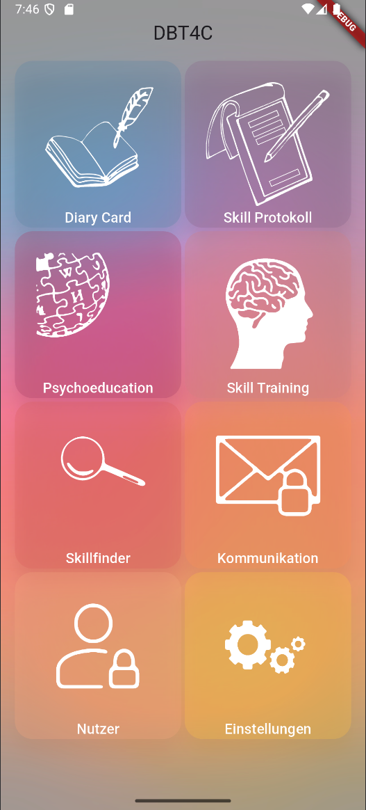
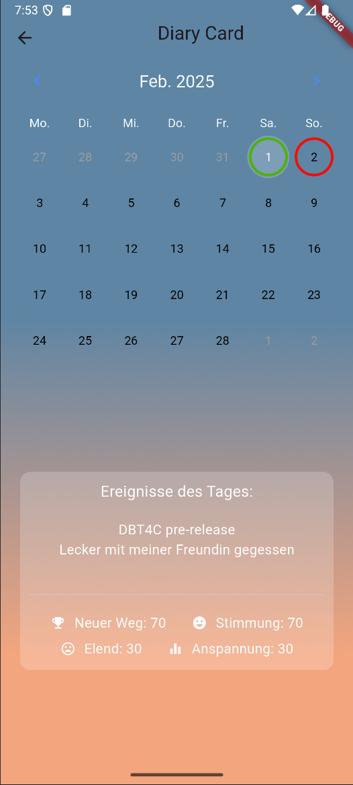
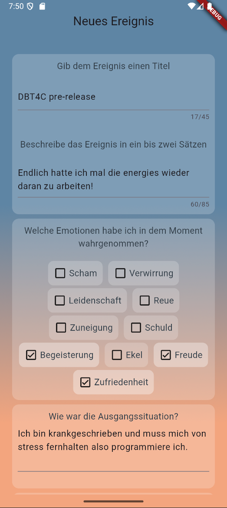
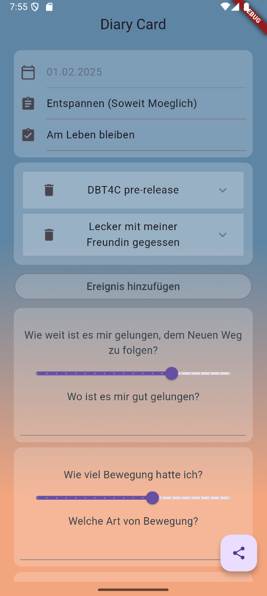
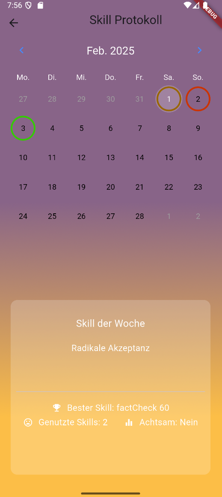
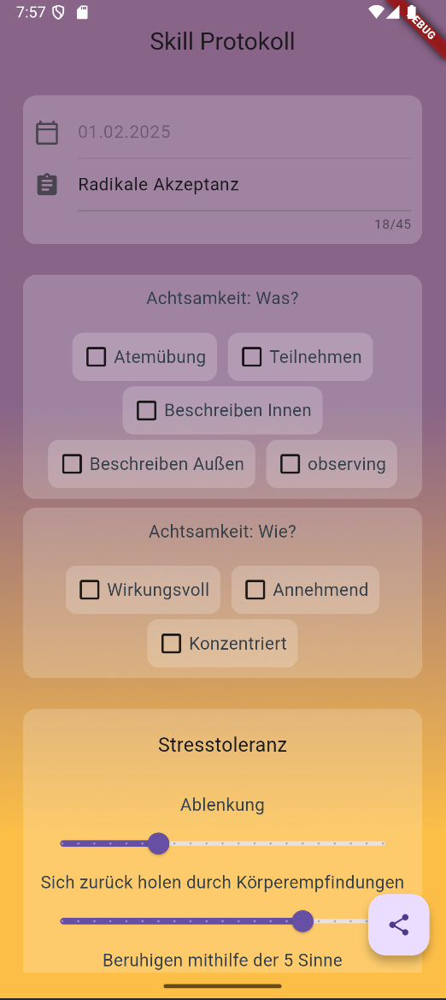

# dbt4c_rebuild

dbt4c_rebuild is, as the name implies, a rebuild of my old mental health app i built with my Roommate but never finished.
It will be free for patients to use and can hopefully help some poeple struggle a little less in DBT.

Features in this first pre release:

    Diary card + calendar for date selection
    Skill Procotoll + calendar for date selection
    Database storage (on device, so far also unencrypted)
    User screen that looks pretty but is also pretty useless

## Screenshots

### Main Menu

### DCard Calendar

### DCard New Event

### DCard Template

### SProt Calendar

### SProt Template

